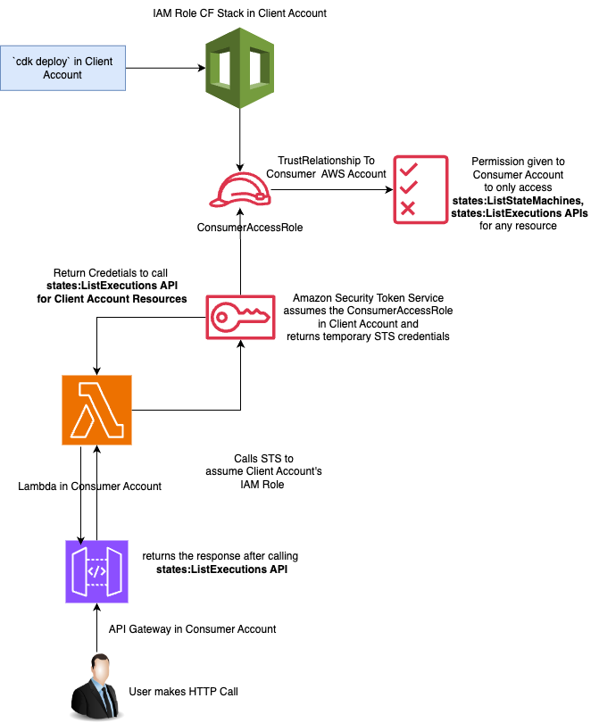

# IAM Role Delegation

IAM Role Delegation is a project that facilitates cross-account access to AWS resources from one AWS Account to other AWS Account. It leverages AWS Identity and Access Management (IAM) roles to allow a Consumer AWS Account to access resources in a Client AWS Account.

## Architecture Diagram


## Table of Contents

- [Overview](#overview)
- [Prerequisites](#prerequisites)
- [Installation](#installation)
- [Usage](#usage)
- [Contributing](#contributing)
- [License](#license)

## Overview

This project consists of AWS Cloud Development Kit (CDK) code to create an IAM role in the Client AWS Account that the Consumer AWS Account can assume. The IAM role has a specific policy attached, granting permission to perform certain actions on AWS Step Functions in the Client Account.

The key components of the project include:

- **ConsumerIamRoleStack**: AWS CDK stack that defines the IAM role, associated policy, and necessary configurations.
- **Policy Statement**: IAM policy statement allowing specific actions on Step Functions in the Client Account.
- **Role**: IAM role in the Client Account that can be assumed by the Consumer Account.
- **External IDs**: External IDs required for assuming the IAM role securely.
- **Output**: Outputs the IAM role ARN to be used by the Consumer Account.

## Prerequisites

Before using this project, make sure you have the following prerequisites:

- **AWS CDK Installed**: Ensure that the AWS Cloud Development Kit (CDK) is installed on your development machine. You can install it using the instructions [here](https://docs.aws.amazon.com/cdk/latest/guide/getting_started.html).

## Installation

1. Clone the repository:

   ```bash
   git clone https://github.com/karmakarsagar37/iam-role-delegation.git
   cd iam-role-delegation
   ```

2. Install dependencies:

   ```bash
   npm install
   ```

## Usage

Follow these steps to use IAM Role Delegation in your AWS environment:

1. **Update ConsumerIamRoleStackProps**: Open the `ConsumerIamRoleStack.ts` file and update the properties in the `ConsumerIamRoleStackProps` interface, including `trustAccount` and `externalIds`.

2. **Deploy the Stack**: Deploy the CDK stack to create the IAM role and associated resources.

   ```bash
   cdk deploy
   ```

3. **Assume the IAM Role**: Use the generated IAM role ARN in the output to assume the role in the Consumer Account and access resources in the Client Account.

4. **To verify the CrossAccount Access**: I have written an API using AWS Lambda and API Gateway which can be deployed to Consumer AWS Account and by triggering this API, you shall be able to test Client Account Access. For more details please refer [here](./lambda/README.md)

## Contributing

If you find issues or have suggestions for improvements, please open an issue or submit a pull request. Contributions are welcome!

## License

This project is licensed under the [MIT License](LICENSE).

---

Customize the above template according to your project's specific details, and make sure to include any additional information that might be helpful for users and contributors.